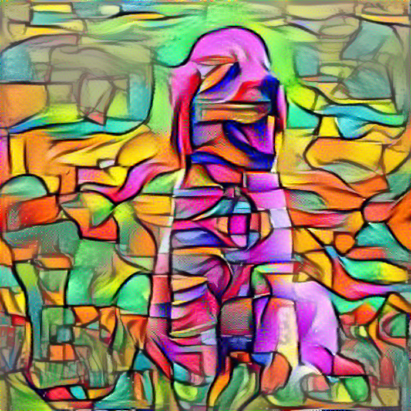
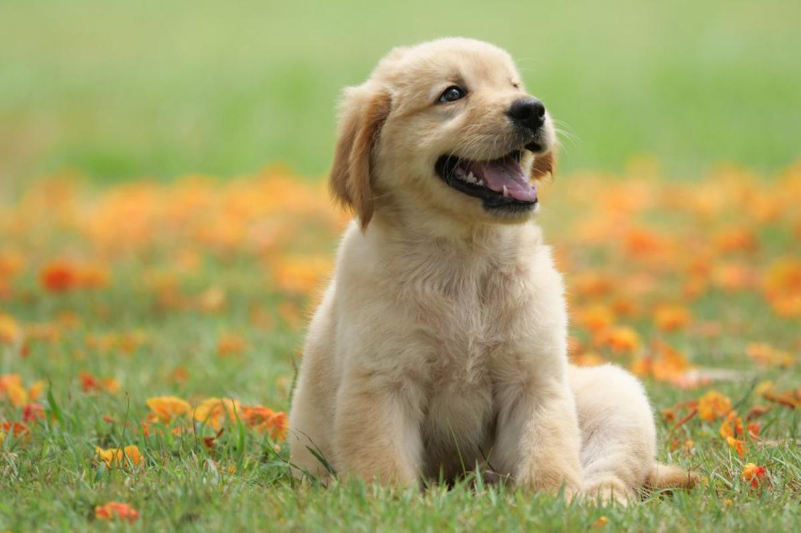
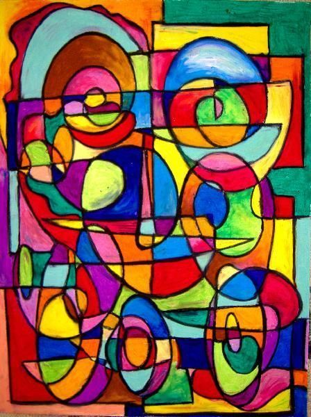

# Neural Style Transfer Art
A simple interactive program which performs neural style transfer to paint an input image in the style of a style image. The program is largely based on the paper [A Neural Algorithm of Artistic Style](https://arxiv.org/pdf/1508.06576.pdf) by Gatys et. al. and an [article](https://towardsdatascience.com/art-with-ai-turning-photographs-into-artwork-with-neural-style-transfer-8144ece44bed) by Apratim Sahu on TowardsDataScience.

# Sample


The above sample was made by styling the following picture of a dog with Picasso's Smile!
 

with 



# Setup
Install dependencies
```sh
apt update
apt install git python3-dev python3-pip build-essential libagg-dev pkg-config
```

Clone repository
```sh
git clone https://github.com/jocelynhsu8/neural-style-transfer-art.git
cd neural-style-trasnfer-art
```

Install requirements
```sh
python3 -m venv env
. env/bin/activate
pip3 install -r requirements.txt
```

# Program Execution
To run the program, place the input (content) image you wish to use in the input directory, and the style image you would like to use in the style directory.
Then, run neural-art.py
```sh
python3 neural-art.py
```

The program will prompt you for the name of the input image and style image respectively, as well as the name you would like to give the output image.
